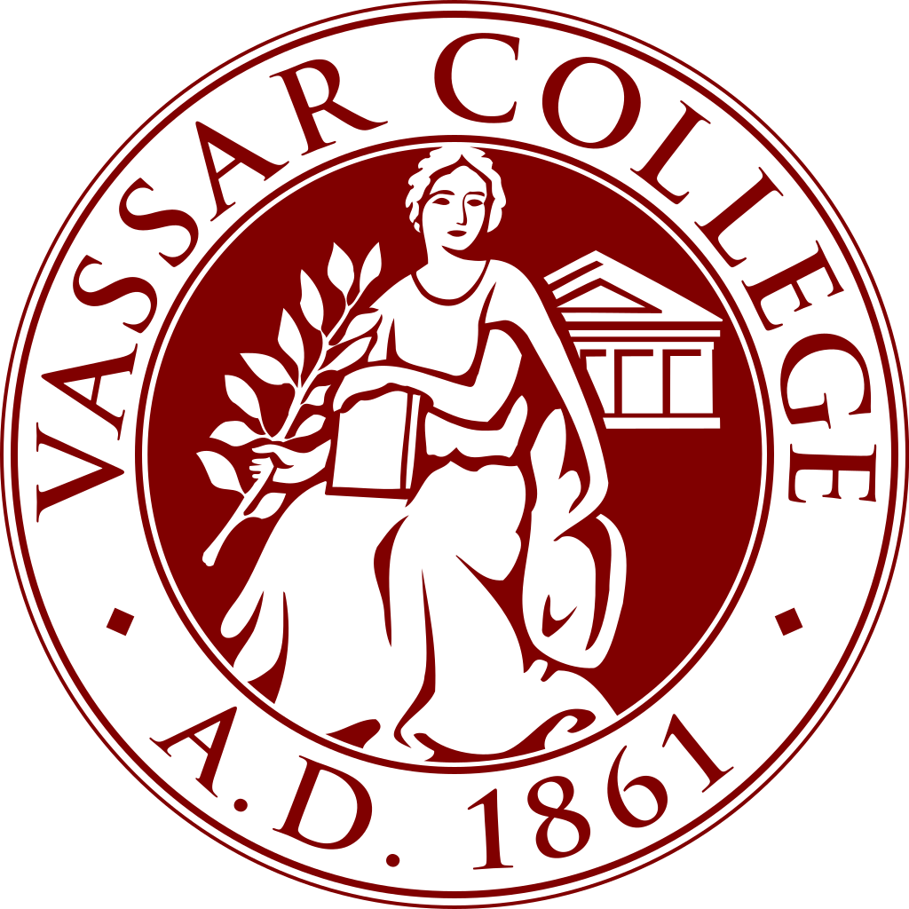

---
output:
  html_document:
    toc: true
    toc_float: true
---

## **EDUCATION**

\

#### MS in **Biostatistics, Statistical Genetics Track**
**Expected Spring 2023**

Relevant Coursework: Biostatistical Methods I, Human Population Genetics, Data Science I

\

#### BA in **Biology**, Minor in **Computer Science**
**Fall 2020**

Relevant Coursework: Bioinformatics, Molecular Genetics, Software Design & Implementation

\

#### Yuan Pei Scholar
**Fall 2018**                                               

Relevant Coursework: Statistical Genomics Analysis, Biochemical Pharmaceutics\
\
\
\

## **WORK EXPERIENCE**
\

#### Lab Assistant, Protein Biochemistry Group
Mar 2021 – Jun 2021\
• Piloted a new sample management workflow; imported 30,000+ protein tubes into the BioBank to support company-wide studies\
• Used ELNs, LIMS, BioRegistry, and more to perform sample management in a timely and responsible manner\
• Aliquoted and distributed protein and AAV samples for the COVID-19, Ebola, RA and other antibody therapeutics programs\
• Appointed as an immediate respondent for Protein Biochemistry for urgent needs during pandemic protocols

\

#### Student Researcher, Dr. J.H. Long’s Biomechanics Lab
Sep 2019 – Dec 2020\
• Senior thesis, Fluid Entrainment and Medusae Morphology Reveal Row Propulsion Proficiency\
• Formulated mathematical models to explain the wake dynamics and foraging techniques found in scyphozoan locomotion\
• Concluded and visualized findings using statsmodels, sklearn, matplotlib, and other analytic Python libraries\
• Presented study in the Vassar Fall 2020 Life Sciences Poster Session; attended weekly meetings to discuss research progress

#### Teaching Assistant, Computer Science III
Sep 2020 – Dec 2020\
•	Guided Computer Science III students under Dr. Saravanan\
•	Designed and graded student assignments and lab work

#### Student Researcher, Dr. J. Schwarz’s Marine Biology Lab
Mar 2020 – May 2020\
• Modeled the functional impact and likelihood of probable CDS mutations in Nemostella hsp70 gene using Python
•	Compiled annotated orthologs from databases such as Swiss-Prot

\

#### Research Assistant, Dr. M.C. Wu’s Bee Lab
Feb 2019 – Jun 2019\
•	Increased the mrjp1 gene expression in A. mellifera to enhance the nutritional richness of royal jelly by 35%, a lab record\
\
\
\

## **SKILLS**
#### Computational
**R / Python / Unit testing / BLAST / SSH**

#### Wet Laboratory
**CRISPR / Gene cloning / qPCR / SDS-PAGE / ELISA**

#### Spoken Language
**Mandarin Chinese**\
\
\
\

## **HONORS & AWARDS**
#### 2021
**The Dorothy Evans Fellowship**\
**The Virginia Swinburne Brownell Prize in Biology**\

#### 2019
**Vassar Internship Grant Fund**\

#### 2017
**Tri-State Collegiate Rugby Champion**

